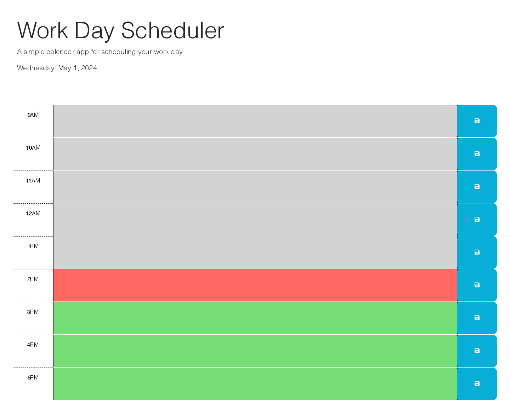

# Berkeley Coding Bootcamp Challenge 5
5th coding bootcamp challenge where students were asked to create a work day scheduler. The scheduler displays the current day at the top, and when users
scroll down, they are presented with time blocks for a standard 9am to 5pm
work day schedule. Each time block is color-coded to indicate whether it is
in the past, present, or future. When a user clicks into a time block, they
can enter an event. Each time block has an individual save button that will
save that entry to their local storage. 

The live version of this project can be accessed at: https://ojds2022.github.io/work_day_scheduler/

